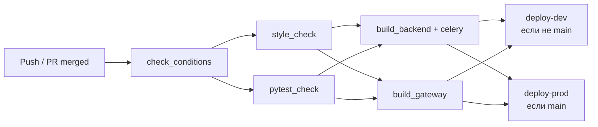

# Cafe Booking System

**Cafe Booking** — асинхронный API-сервис для бронирования столиков в кафе, разработанный на FastAPI. Проект решает проблему хаотичного бронирования по телефону, предоставляя клиентам онлайн-инструмент для управления бронированиями, а владельцам и менеджерам — централизованную систему управления заведениями, столами и временными слотами. Сервис автоматически отправляет уведомления и напоминания через Celery, использует RabbitMQ как брокер сообщений, а Redis — для кеширования часто запрашиваемых данных. Основная цель — сделать процесс бронирования прозрачным, удобным и исключающим двойные записи.

## Содержание

- [⚡ Возможности проекта](#-возможности-проекта)
- [📚 API Documentation](#-api-documentation)
- [👥 Роли и их возможности](#-роли-и-их-возможности)
- [⏱️ Управление задачами Celery через API](#️-управление-периодическими-задачами-celery-через-api)
- [🚀 CI/CD Pipeline](#-cicd-pipeline)
- [⚙️ Переменные окружения](#️-переменные-окружения)
- [🐳 Запуск проекта (DEV)](#-запуск-проекта)
- [📦 Работа через DevContainer](#-работа-через-devcontainer)
- [🗄️ Миграции](#️-миграции)
- [📊 Фикстуры](#-фикстуры)
- [👤 Создание суперпользователя](#-создание-суперпользователя)
- [🧪 Тесты](#-тесты)
- [📁 Структура проекта](#-структура-проекта)

## 🛠️ Стек технологий

[](https://www.python.org/downloads/release/python-3120/)
[](https://docs.astral.sh/uv/)
[](https://fastapi.tiangolo.com/)
[](https://www.postgresql.org/)
[](https://www.rabbitmq.com/)
[](https://redis.io/)
[](https://www.docker.com/)
[](https://docs.celeryq.dev/)
[](https://docs.pytest.org/)
[](https://github.com/fktrctq/cafe-booking/actions)
[](https://cafe-booking-dev.ruviewer.ru)

### 🐍 Язык и окружение

- **Python 3.12** — целевая версия интерпретатора
- **uv** — универсальный менеджер пакетов и инструмент управления проектом (замена pip + venv + pip-tools)
- **Ruff** — сверхбыстрый линтер и форматтер (замена flake8, black, isort)
- **Pre-commit** — хуки Git для автоматической проверки кода перед коммитом

### 🌐 Веб-фреймворк API

- **FastAPI** — асинхронный веб-фреймворк для построения REST API

### 🗄️ Базы данных и миграции

- **PostgreSQL** — основная реляционная БД
- **SQLAlchemy** — ORM для работы с БД (асинхронный режим)
- **Alembic** — инструмент для управления миграциями схемы БД

### 📨 Асинхронные задачи и очереди

- **RabbitMQ** — брокер сообщений
- **Celery** — распределённая очередь задач
- **Flower** — веб-интерфейс для мониторинга Celery
- **API управления Celery Beat** — динамическое создание и управление периодическими задачами через REST API

### ⚡ Кеширование

- **Redis** — высокопроизводительное in-memory хранилище
- **Кастомный Redis-клиент** — с поддержкой асинхронности
- **Кастомный кеш-клиент с SWR (Stale-While-Revalidate)** — стратегия кеширования с фоновым обновлением
- **Декоратор кеширования**

### 🔧 Кастомные Middleware

- **Аутентификация** (`AuthMiddleware`) — кастомный JWT-мидлварь для проверки токена, подстановки текущего пользователя в `request.state.user` с кешированием пользователя (SWR-стратегия)
- **Логирование** (`LoggingMiddleware`) — кастомный мидлварь для логирования всех входящих запросов и ответов:
  - Логирование запросов (метод, путь, IP клиента, `trace_id`, пользователь)
  - Логирование ответов (статус, длительность в мс)
  - Логирование ошибок с телом запроса
  - Поддержка `X-Forwarded-For` для определения реального IP клиента
  - Генерация `X-Request-ID` для трейсинга запросов

### 🧪 Тестирование

- **Pytest** — фреймворк для модульного и интеграционного тестирования

### 🐳 Контейнеризация и среда разработки

- **Docker / Docker Compose** — контейнеризация всех сервисов (приложение + БД + RabbitMQ + Redis)
- **Dev Containers for VSCode** — изолированная среда разработки в контейнере
---


## ⚡ Возможности проекта

- 🔐 **Аутентификация и авторизация** — JWT-токены, роли `USER`, `MANAGER`, `ADMIN`
- 👤 **Управление пользователями** — регистрация, просмотр, редактирование, блокировка
- ☕ **Управление кафе** — создание, редактирование, просмотр кафе
- 🪑 **Управление столами** — создание, редактирование, просмотр, блокировка столов в кафе
- ⏰ **Управление временными слотами** — настройка интервалов бронирования
- 📅 **Бронирование** — создание, просмотр, изменение и отмена бронирований с выбором даты, времени и стола
- 🖼️ **Медиа** — загрузка изображений с конвертацией в JPG и получение по ID
- 📨 **Фоновые задачи** — уведомления и напоминания через Celery + RabbitMQ
- ⚡ **Кеширование** — Redis + SWR-стратегия для быстрых ответов
- 🧪 **Тестирование** — Pytest с отдельной тестовой БД
- 🐳 **Контейнеризация** — Docker + DevContainer для единообразной разработки
- 🔄 **CI/CD** — GitHub Actions: линтинг, тесты, сборка и деплой
---

## 🌐 Демо:

- **UI**: [https://cafe-booking-dev.ruviewer.ru](https://cafe-booking-dev.ruviewer.ru)
- **Документация Swagger UI**: [https://cafe-booking-dev.ruviewer.ru/docs](https://cafe-booking-dev.ruviewer.ru/docs#/)
- **Документация ReDoc**: [https://cafe-booking-dev.ruviewer.ru/redoc](https://cafe-booking-dev.ruviewer.ru/redoc)
---


## 📚 API Documentation

Базовый URL для всех запросов: `/api/v1`

### 🔑 Аутентификация

Большинство эндпоинтов защищены JWT-токеном. Для доступа к ним необходимо в заголовке запроса передавать:
Authorization: Bearer <your_access_token>

| Метод | Эндпоинт | Описание | Доступ |
|-------|----------|----------|--------|
| `POST` | `/auth/login` | Авторизация пользователя. Принимает **логин** (email или телефон) и **пароль**. Возвращает JWT токен. | Публичный |

### 👤 Пользователи

| Метод | Эндпоинт | Описание | Доступ |
|-------|----------|----------|--------|
| `GET` | `/users/` | Получение списка всех пользователей. | Менеджер, Админ |
| `POST` | `/users/` | Регистрация нового пользователя. | Публичный |
| `GET` | `/users/me` | Получение профиля текущего авторизованного пользователя. | Аутентифицированные |
| `PATCH` | `/users/me` | Обновление профиля текущего пользователя. | Аутентифицированные |
| `GET` | `/users/{user_id}` | Получение пользователя по UUID. | Менеджер, Админ |
| `PATCH` | `/users/{user_id}` | Обновление данных пользователя по UUID. | Менеджер, Админ |

### ☕ Кафе

| Метод | Эндпоинт | Описание | Доступ |
|-------|----------|----------|--------|
| `GET` | `/cafes/` | Получение списка кафе. Опциональный фильтр `show_active`. | Аутентифицированные |
| `POST` | `/cafes/` | Создание нового кафе. | Менеджер, Админ |
| `GET` | `/cafes/{cafe_id}` | Получение кафе по UUID. | Аутентифицированные |
| `PATCH` | `/cafes/{cafe_id}` | Обновление данных кафе. | Менеджер, Админ |

### 🪑 Столы (внутри кафе)

| Метод | Эндпоинт | Описание | Доступ |
|-------|----------|----------|--------|
| `GET` | `/cafes/{cafe_id}/tables/` | Список столиков в кафе. Опционально `show_active`. | Аутентифицированные |
| `POST` | `/cafes/{cafe_id}/tables/` | Создание нового столика в кафе. | Менеджер, Админ |
| `GET` | `/cafes/{cafe_id}/tables/{table_id}` | Получение столика по UUID. | Аутентифицированные |
| `PATCH` | `/cafes/{cafe_id}/tables/{table_id}` | Обновление данных столика. | Менеджер, Админ |

### ⏰ Временные слоты (интервалы бронирования)

| Метод | Эндпоинт | Описание | Доступ |
|-------|----------|----------|--------|
| `GET` | `/cafes/{cafe_id}/time_slots/` | Список временных слотов кафе. Опционально `show_active`. | Аутентифицированные |
| `POST` | `/cafes/{cafe_id}/time_slots/` | Создание нового слота. | Менеджер, Админ |
| `GET` | `/cafes/{cafe_id}/time_slots/{slot_id}` | Получение слота по UUID. | Аутентифицированные |
| `PATCH` | `/cafes/{cafe_id}/time_slots/{slot_id}` | Обновление данных слота. | Менеджер, Админ |

### 📅 Бронирования

| Метод | Эндпоинт | Описание | Доступ |
|-------|----------|----------|--------|
| `GET` | `/booking/` | Список бронирований. Фильтры: `show_active`, `cafe_id`, `user_id`. | Аутентифицированные |
| `POST` | `/booking/` | Создание нового бронирования (выбор стола + слота). | Аутентифицированные |
| `GET` | `/booking/{booking_id}` | Получение бронирования по UUID. | Аутентифицированные |
| `PATCH` | `/booking/{booking_id}` | Обновление данных бронирования. | Аутентифицированные |

### 🖼️ Медиа (изображения)

| Метод | Эндпоинт | Описание | Доступ |
|-------|----------|----------|--------|
| `GET` | `/media/{media_id}` | Получение изображения в формате JPG по UUID. | Публичный |
| `POST` | `/media/` | Загрузка нового изображения (multipart/form-data). | Менеджер, Админ |

### ⏱️ Celery Beat / Управление расписаниями

*Эндпоинты для создания и управления расписаниями периодических задач.*

| Метод | Эндпоинт | Описание |
|-------|----------|----------|
| `GET` | `/schedule/clocked` | Список однократных расписаний. |
| `POST` | `/schedule/clocked` | Создать однократное расписание. |
| `DELETE` | `/schedule/clocked/{schedules_id}` | Удалить однократное расписание. |
| `GET` | `/schedule/interval` | Список интервальных расписаний. |
| `POST` | `/schedule/interval` | Создать интервальное расписание. |
| `DELETE` | `/schedule/interval/{schedules_id}` | Удалить интервальное расписание. |
| `GET` | `/schedule/crontab` | Список cron-расписаний. |
| `POST` | `/schedule/crontab` | Создать cron-расписание. |
| `DELETE` | `/schedule/crontab/{schedules_id}` | Удалить cron-расписание. |

### 📋 Celery Beat / Управление задачами

*CRUD для периодических задач, привязанных к расписаниям.*

| Метод | Эндпоинт | Описание |
|-------|----------|----------|
| `GET` | `/schedule/task` | Список всех периодических задач. |
| `POST` | `/schedule/task` | Создать задачу. |
| `GET` | `/schedule/task/{task_id}` | Получить задачу по ID. |
| `PATCH` | `/schedule/task/{task_id}` | Обновить задачу. |
| `DELETE` | `/schedule/task/{task_id}` | Удалить задачу. |
| `POST` | `/schedule/task/{task_id}/enable` | Включить задачу. |
| `POST` | `/schedule/task/{task_id}/disable` | Отключить задачу. |

### ❤️ Health Check

| Метод | Эндпоинт | Описание |
|-------|----------|----------|
| `GET` | `/health` | Проверка работоспособности сервиса и его зависимостей. |

---

## 👥 Роли и их возможности

### 👤 Клиент (USER)

- Регистрация и авторизация
- Просмотр списка кафе, столов и доступных временных слотов
- Создание бронирования с выбором даты, времени и стола
- Просмотр своих бронирований
- Изменение и отмена своих бронирований

### 🛠️ Менеджер (MANAGER)

- Всё, что может **Клиент**
- Управление кафе (создание, редактирование)
- Управление столами в кафе (создание, редактирование, блокировка)
- Управление временными слотами (создание, редактирование, блокировка)
- Просмотр всех бронирований в своих кафе
- Управление изображениями (загрузка, удаление)

### 👑 Администратор (ADMIN)

- Всё, что может **Менеджер**
- Полный доступ ко всем кафе и их объектам
- Управление пользователями (создание, редактирование, блокировка/разблокировка)
- Просмотр всех бронирований системы
- Управление ролями пользователей
- Полный доступ к управлению кафе, столами и слотами
---

## ⏱️ Управление периодическими задачами Celery через API

В проекте реализовано динамическое управление задачами Celery Beat через REST API. Это позволяет настраивать фоновые процессы (например, отправку уведомлений) без остановки и пересборки контейнеров.

### 🔧 Основные сценарии

- Создание расписания (интервальное, хронологическое, однократное)
- Создание новой периодической задачи с привязкой к расписанию
- Включение/отключение существующей задачи без её удаления
- Обновление параметров задачи (время выполнения, аргументы, приоритет)

### 📝 Пример: создание задачи для отправки напоминаний

Для создания задачи необходимо отправить `POST` запрос на `/api/v1/schedule/task` с телом:

```json
{
  "task": "tasks.send_upcoming_bookings",
  "kwargs": {
    "notify_target": "both",
    "reminder_minutes_before": 60,
    "task_interval_minutes": 10
  },
  "enabled": true,
  "name": "Отправка уведомлений",
  "description": "Ежедневная отправка отчета",
  "queue": "default",
  "priority": 0,
  "one_off": false,
  "schedule_id": 0,
  "discriminator": "intervalschedule"
}
```

### 📋 Параметры задачи

| Параметр | Тип | Описание |
|----------|-----|----------|
| `task` | string | Путь к задаче (например, `tasks.send_upcoming_bookings`) |
| `args` | array | Позиционные аргументы задачи |
| `kwargs` | object | Именованные аргументы задачи |
| `enabled` | boolean | Активна ли задача (true/false) |
| `name` | string | Название задачи |
| `description` | string | Описание задачи |
| `queue` | string | Очередь в брокере сообщений (`default`) |
| `priority` | integer | Приоритет задачи (0–255, где 0 — наивысший) |
| `one_off` | boolean | Однократная задача (только для `clockedschedule`) |
| `schedule_id` | integer | ID предварительно созданного расписания |
| `discriminator` | string | Тип расписания: `intervalschedule`, `crontabschedule`, `clockedschedule` |

### 📌 Аргументы задачи `tasks.send_upcoming_bookings`

| Аргумент | Тип | Описание |
|----------|-----|----------|
| `notify_target` | string | Кого оповещать: `client`, `manager`, `both` |
| `reminder_minutes_before` | integer | За сколько минут до бронирования отправлять напоминание |
| `task_interval_minutes` | integer | Интервал выполнения задачи в минутах |

### 🔄 Жизненный цикл задачи

1. **Создание расписания** — через эндпоинты `/schedule/interval`, `/schedule/crontab` или `/schedule/clocked`
2. **Создание задачи** — через `/schedule/task` с указанием `schedule_id` и `discriminator`
3. **Управление** — включение/отключение через `/schedule/task/{task_id}/enable` и `/schedule/task/{task_id}/disable`
4. **Обновление** — изменение параметров через `PATCH /schedule/task/{task_id}`
5. **Удаление** — `DELETE /schedule/task/{task_id}`
---

## 🚀 CI/CD Pipeline
[](https://github.com/fktrctq/cafe-booking/actions)

Автоматизация сборки, тестирования и деплоя через **GitHub Actions**.

### 🔄 Workflow: `Main booking cafe workflow`

| Триггер | Ветки | Условие |
|---------|-------|---------|
| `push` | `feature/deploy` | Всегда |
| `pull_request` (closed) | `develop`, `main` | Только при объединении (merged) |


### 📋 Jobs

| Job | Описание | Зависит от |
|-----|----------|------------|
| **`style_check`** | Линтинг и форматирование (Ruff) | — |
| **`pytest_check`** | Запуск тестов (Pytest) | — |
| **`build_backend_celery`** | Сборка образов **backend** + **celery** в Docker Hub | `style_check`, `pytest_check` |
| **`build_gateway`** | Сборка образа **Nginx-шлюза** в Docker Hub | `style_check`, `pytest_check` |
| **`deploy-dev`** | Деплой на **development** (если `develop` и `feature/deploy`) | Все сборки |
| **`deploy-prod`** | Деплой на **production** (если `main`) | Все сборки |


### 🐳 Docker-образы

| Имя образа | Теги |
|------------|------|
| `bookin-cafe-backend` | `:latest`, `:<sha>` |
| `bookin-cafe-celery` | `:latest`, `:<sha>` |
| `bookin-cafe-gateway` | `:latest`, `:<sha>` |


### 🌍 Окружения

| Окружение | Ветка | Назначение |
|-----------|-------|------------|
| **Development** | `develop` и `feature/deploy` | Тестовый сервер для разработки |
| **Production** | `main` | Боевой сервер |


### 🔐 Необходимые секреты

| Группа | Секреты |
|--------|---------|
| **Docker Hub** | `DOCKER_USERNAME`, `DOCKER_PASSWORD` |
| **Сервер** | `SERVER_HOST`, `SERVER_USER`, `SERVER_SSH_KEY` |
| **Приложение** | `SECRET`, `SUPERUSER_*`, `POSTGRES_*` |
| **RabbitMQ** | `RABBITMQ_DEFAULT_USER`, `RABBITMQ_DEFAULT_PASS` |
| **SMTP** | `SMTP_USER`, `SMTP_PASSWORD`, `SMTP_FROM_EMAIL` |
| **Flower** | `FLOWER_BASIC_AUTH` |

> Полный список переменных и секретов доступен в `[.github/workflows/main.yml](https://github.com/fktrctq/cafe-booking/blob/main/.github/workflows/main.yml)`

**⚠️ Важно:** Все секреты и переменные должны быть настроены в `Settings > Secrets and variables > Actions` вашего репозитория.

### 📊 Схема пайплайна


---

## ⚙️ Переменные окружения

- .env — файл с переменными для разработки
- .env.base — базовые переменные (CI/CD)
- .env.cache — настройки Redis-кеша (разработка + CI/CD)

Перед разработкой проекта нужно создать файл окружения на основе примера:

```bash
cp infra/.env.example infra/.env
```

**⚠️ Важно:** Копию отредактированного infra/.env необходимо скопировать в .devcontainer/ для работы DevContainer.
---

## 🐳 Запуск проекта

### 🚀 Запуск

Из директории `infra` выполните:

```bash
cd infra
docker compose -f docker-compose-develop.yaml up -d --build
```

#### После запуска будут доступны:

| Сервис | Адрес |
|--------|-------|
| **API** | [http://localhost:8000](http://localhost:8000) |
| **Flower** | [http://localhost:5555](http://localhost:5555) |
| **RabbitMQ Management** | [http://localhost:15672](http://localhost:15672) |

### 🛑 Остановка

```bash
docker compose -f docker-compose-develop.yaml down
```
---

## 📦 Работа через DevContainer

Разработка проекта рассчитана на использование **Dev Containers** в VSCode.

Перед началом работы должны быть установлены:

- Docker;
- расширение `Dev Containers` для `VSCode`.

### 🏗️ Создание DevContainer

Для открытия проекта в контейнере:

1. откройте проект в VSCode;
2. нажмите `Ctrl + Shift + P`;
3. выберите команду `Dev Containers: Reopen in Container`.

После этого начнётся сборка контейнера. В процессе будут установлены Python, uv, зависимости проекта и плагины VSCode.

> **💡 Совет:** Если после сборки контейнера VSCode подсвечивает установленные пакеты как неизвестные, перезапустите VSCode или дождитесь индексации окружения.

### 🔑 Настройка Git внутри DevContainer

```bash
git config --global user.name "Your Name"
git config --global user.email "your_email@example.com"
```

### 🔐 Настройка SSH для GitHub внутри DevContainer

Первый вариант — скопировать существующие SSH-ключи с хоста в контейнер:

```text
/home/vscode/.ssh
```

Второй вариант — создать новую пару ключей внутри контейнера:

```bash
ssh-keygen -t ed25519 -C "your_email@example.com"
```

Добавить публичный ключ в GitHub:

```text
GitHub -> Settings -> SSH and GPG keys -> SSH keys
```

### 🐞 Запуск в режиме отладки VSCode

Проект можно запустить через встроенную отладку VSCode:

1. откройте вкладку `Run and Debug`;
2. выберите конфигурацию запуска (FastAPI + Celery/FastAPI + Celery + Beat или отдельные сервисы);
3. Запустите выбранную конфигурацию.

Конфигурацию запуска можно изменить в файле:

```text
.vscode/launch.json
```
---

## 🗄️ Миграции

Применение миграций:

```bash
cd src
uv run alembic upgrade head
```
---

## 📊 Фикстуры

Фикстуры для наполнения базы тестовыми данными.

> **👆 Перед загрузкой фикстур примените миграции**

Задайте `PYTHONPATH`:

```bash
export PYTHONPATH=/workspace/src
```

Запустите загрузку фикстур:

```bash
cd src/fixtures
uv run python gen_load_fixtures.py
```
---


## 👤 Создание суперпользователя

При запуске сервиса создается суперпользователь. Учетные данные из `.env`:

- `SUPERUSER_EMAIL`
- `SUPERUSER_PASSWORD`
- `SUPERUSER_NAME`

Существует возможность создания суперпользователя из консоли:

```bash
export PYTHONPATH=/workspace/src
```

```bash
cd src/scripts
uv run create_superuser.py -l admin@cafe-booking.ru -u Admin -p supersecretpassword
```
---

## 🧪 Тесты

Тесты используют отдельную базу данных (переменная в .env DB_PYTEST), которая создается автоматически при запуске тестов.

Запуск всех тестов из корня проекта:

```bash
PYTHONPATH=src uv run pytest
```
---

## 📁 Структура проекта

```
cafe-booking/
├── .devcontainer/                 # Конфигурация DevContainer для VSCode
├── .dockerignore                  # Игнорируемые файлы для Docker
├── .pre-commit-config.yaml        # Pre-commit хуки (Ruff, форматирование)
├── Makefile                       # Make команды для автоматизации
├── pyproject.toml                 # Зависимости и настройки проекта (uv)
├── README.md                      # Документация проекта
├── ruff.toml                      # Конфигурация Ruff линтера
├── uv.lock                        # Lock файл зависимостей
│
├── infra/                         # Инфраструктура и Docker Compose
│   ├── docker-compose-develop.yaml      # Docker Compose для разработки
│   ├── docker-compose-production.yaml   # Docker Compose для продакшена
│   ├── Dockerfile                       # Dockerfile для сборки сервиса и celery/beat
│   ├── nginx/                           # Конфигурация Nginx шлюза
│   │   ├── Dockerfile
│   │   ├── nginx.conf.template
│   │   ├── proxy-headers.conf
│   │   ├── proxy-websocket.conf
│   │   └── real-ip.conf
│   ├── postgresql.conf             # Конфигурация PostgreSQL
│   └── redis.conf                  # Конфигурация Redis
│
├── src/                           # Исходный код приложения
│   ├── alembic.ini                # Конфигурация Alembic
│   ├── celery_app.py              # Точка входа Celery
│   ├── main.py                    # Точка входа FastAPI
│   ├── api/                       # API слой
│   │   ├── endpoints/             # FastAPI эндпоинты
│   │   ├── routers.py             # Объединение роутеров
│   │   ├── services/              # Бизнес-логика API
│   │   └── validators/            # Валидаторы для API
│   ├── cache/                     # Кеширование (Redis, SWR)
│   │   ├── cache.py               # Кеш-клиент
│   │   ├── cache_key.py           # Генерация ключей/тегов кеша
│   │   ├── cleaner_cache.py       # Очистка кеша
│   │   ├── decorator.py           # Декоратор для кеширования
│   │   ├── redis_client.py        # Клиент Redis
│   │   ├── services.py            # Сервисы кеширования
│   │   └── swr_cache.py           # Кеш-клиент с Stale-While-Revalidate стратегией
│   │
│   ├── celery_core/               # Celery (фоновые задачи)
│   │   ├── base.py                # Базовые настройки
│   │   ├── config.py              # Конфигурация Celery
│   │   ├── beat/                  # Управление расписаниями (CRUD)
│   │   ├── services/              # Сервисы для задач
│   │   ├── tasks/                 # Задачи
│   │   └── templates/             # HTML шаблоны для задач
│   │
│   ├── core/                      # Ядро приложения
│   │
│   ├── crud/                      # CRUD операции
│   ├── fixtures/                  # Тестовые данные
│   │   ├── example/               # JSON файлы с данными
│   │   └── gen_load_fixtures.py   # Скрипт загрузки фикстур
│   │
│   ├── middleware/                # Промежуточное ПО
│   │   ├── auth/                  # Кастомный middleware Аутентификация
│   │   └── logging.py             # Кастомный middleware логирования запросов
│   │
│   ├── migrations/                # Alembic миграции
│   ├── models/                    # SQLAlchemy модели
│   ├── schemas/                   # Pydantic схемы
│   └── scripts/                   # Утилитные скрипты
│       └── create_superuser.py    # Создание суперпользователя
├── tests/                         # Тесты
└── uv.lock                        # Lock файл зависимостей
```

## 📄 Лицензия

MIT
